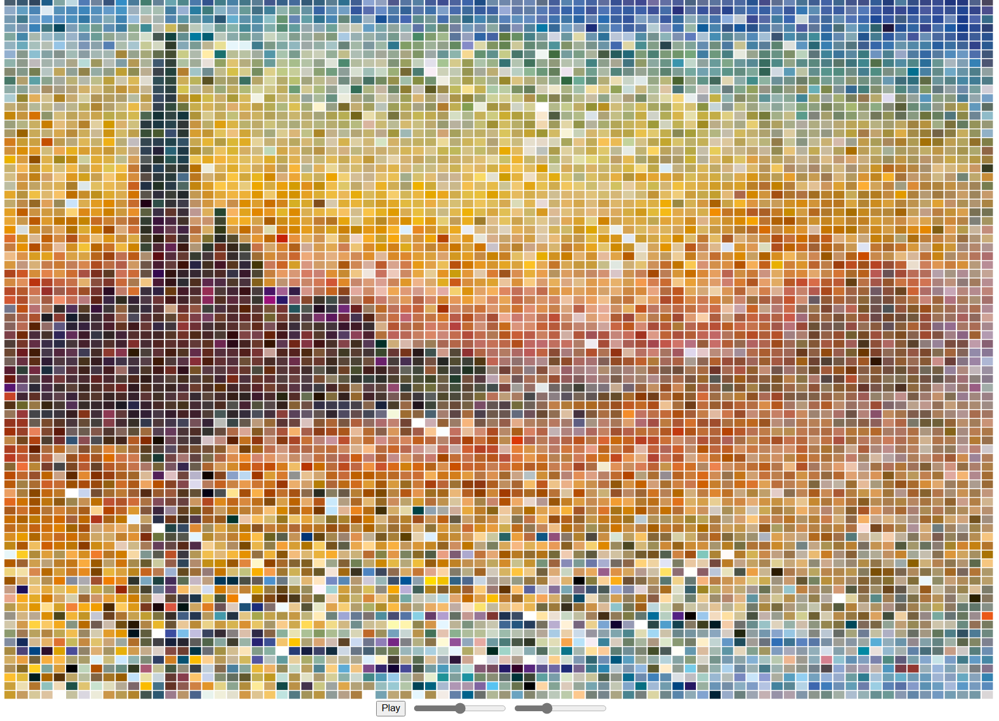
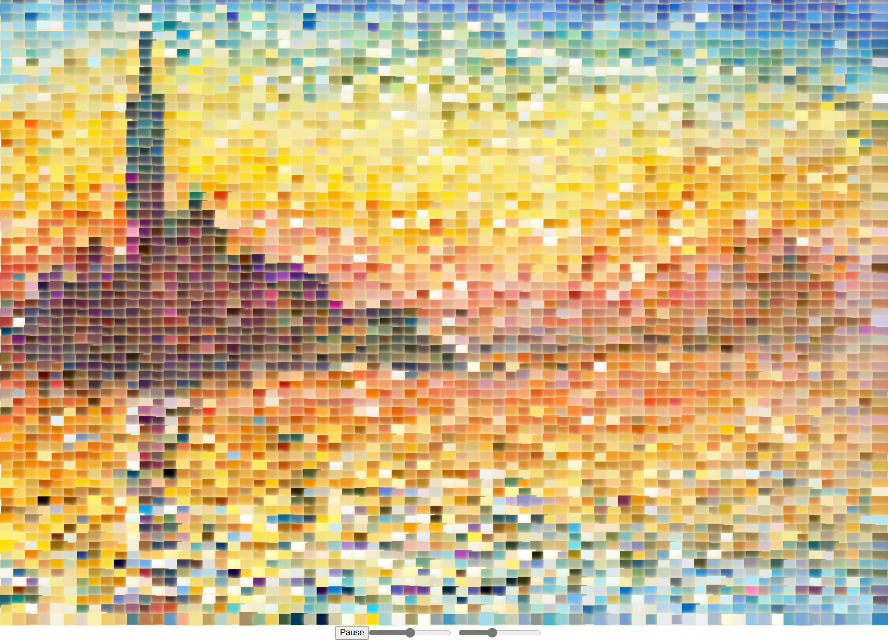
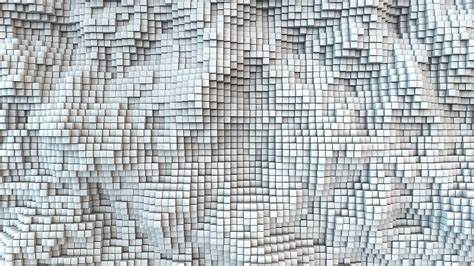
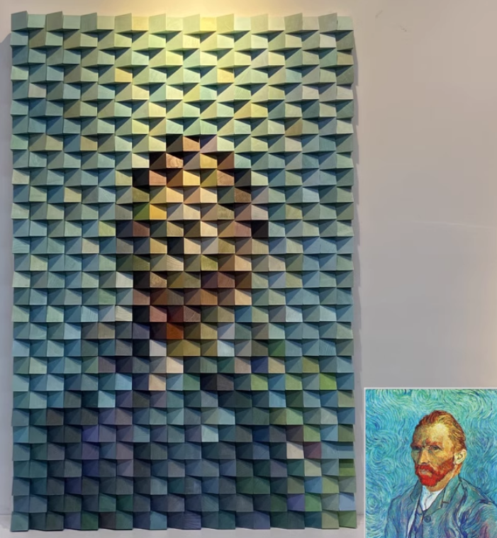

# jxio0581_Major_project
 
## Functional Prototype Description

### Instruction

When the webpage opens, three buttons appear just below the window: from left to right, these are the play/pause button, the volume adjustment slider, and the speed adjustment slider. Clicking "Play" activates a visual animation that syncs with the audio. The sliders allow users to adjust volume and play speed in **real-time**. (I've reduced the number of rectangles in code in order to keep the animation smooth. This is why the actual animation doesn't quite match the illustration)

### Description
For this project, I used **audio** data to drive the animation. The visual consists of hundreds of rectangles. Their sizes and colors change based on the audio input. The difference between my animation effect and other group members is that my effect increases the size and brightness of each rectangle simultaneously, creating a **sense of depth** and a three-dimensional quality. Together with **slow-motion effects** and soothing music, the animation achieves a dynamic, immersive feeling.

### Inspiration
These works are mosaic image of rectangles that produces a three-dimensional effect through variations in size, light, and shadow. My goal was to create a similar effect with code, enhancing the three-dimensionality of the image while using a mosaic effect to simplify and enliven the visuals.

### Technical Explanation
To enhance **expandability**, I encapsulated the base code and organized its functions into various classes and methods. Using p5.js’s built-in methods, I extracted and analyzed the audio spectrum. This spectrum data then drives the animation by influencing rectangle size and color changes in sync with the audio. I added a slow-motion effect by setting front and back states and applying the **lerp()** method, making transitions in size and color gradual and smooth, resulting in a more natural animation.

In terms of additional effects, I added **glow effect** to each rectangle. The code for this effect  creates either a subtle depth effect or a luminous glow. The radiant effect aligns well with the original artwork’s atmospheric sunset theme, inspired by this [YouTube video ](https://www.youtube.com/watch?v=iIWH3IUYHzM) 

